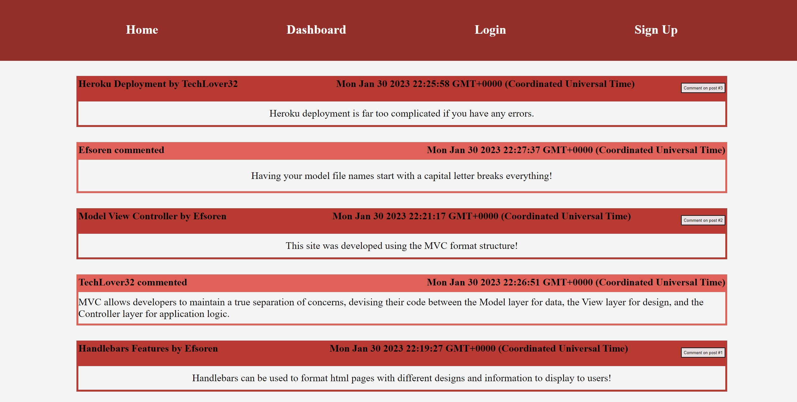

# c14-techBlog

# Table of Contents
<a href = 'https://github.com/EfSoren/c9-readmeGen/edit/main/README.md#description'> Description</a> 
<a href = 'https://github.com/EfSoren/c9-readmeGen/edit/main/README.md#installation'> Installation</a> 
<a href = 'https://github.com/EfSoren/c9-readmeGen/edit/main/README.md#usage'> Usage</a> 
<a href = 'https://github.com/EfSoren/c9-readmeGen/edit/main/README.md#questions'> Questions</a> 

## Description
A tech blog where you can view, post, and comment about all things tech! 
To add posts or comments you will need to create an account and be signed in.

## Installation
N/A app is deployed to heroku

## Usage
Create an account and start communicating with others!

## Questions
Please refer to either my github or email with any questions you may have
https://github.com/EfSoren
ef.sorensen@me.com
https://immense-temple-15308.herokuapp.com/home
